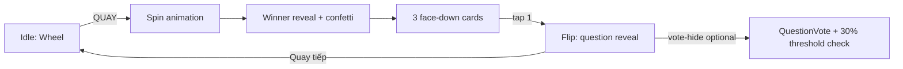

# ARCHITECTURE.md — GroupTalk

System map for agents and contributors. Source of truth for product logic is [GroupTalk.md](GroupTalk.md); execution tracking lives in [TODO.md](TODO.md); phased implementation plans live in [plans/](plans/).

---

## 1. What this is

GroupTalk is a single-device, pass-the-phone party game: spin a wheel to pick a player, draw 1 of 3 question cards, answer in front of the group. Community-contributed question pool with self-cleaning moderation (vote-hide + 30% auto-delete threshold). No host role, no real-time multi-device sync — "copy session" lets a group resume on a new phone via an 8-digit code.

## 2. Tech stack

| Layer | Technology | Role |
|---|---|---|
| Framework | Next.js (App Router) | UI + Server Actions / route handlers |
| Language | TypeScript | Type safety across client/server |
| Styling | Tailwind CSS v4 + shadcn/ui | Design tokens, base components |
| Client state | zustand (+ persist middleware) | In-progress session-setup draft (categories/players) before a `GameSession` exists |
| Animation | framer-motion, canvas-confetti | Wheel spin, card flip, winner confetti |
| Auth | NextAuth.js (Auth.js) v5 + Google provider | Optional login for cross-device history |
| ORM | Prisma (driver adapters, `@prisma/adapter-pg`) | Source-of-truth data access |
| Database | PostgreSQL | Users, sessions, players, questions, votes, answers |
| Cache/Lock | Redis (`ioredis`) | Per-`sessionId` distributed lock (spin race protection) |
| Deployment | Bare Node process (PM2/systemd) on a self-hosted VPS | Postgres/Redis managed independently |

## 3. Identity model

No roles/permissions — whoever holds the phone controls everything (PRD §3). Two identity paths, both resolving to a `User` row:

- **Guest:** `deviceId` = `crypto.randomUUID()` generated client-side, stored in `localStorage` only, sent explicitly with requests. **Known limitation (accepted for v1):** this is spoofable since it's not cookie/session-verified — acceptable because guest data is low-sensitivity.
- **Google:** NextAuth session via Google OAuth, used only to persist `displayName` and history across devices — never for permissions.

See `lib/identity.ts` (PLAN-001).

## 4. Data model (Prisma)

| Model | Purpose |
|---|---|
| `User` | Guest or Google identity; `displayName` used for question-contribution credit |
| `GameSession` | One play session; `sessionCode` (unique 8-digit, Redis-`INCR`-backed) enables copy-to-new-device |
| `SessionPlayer` | Player name within a session (no account mapping) |
| `Topic` | Hardcoded question topics |
| `Question` | Card content; `categories[]`, `contributedByUserId`, `isDeleted` (soft-delete via vote threshold) |
| `SessionAnswer` | History: which player answered which question in which session; unique `[sessionId, sessionPlayerId, questionId]` |
| `QuestionVote` | Personal vote-hide; unique `[userId, questionId]`; ratio ≥30% of all `User`s → global `isDeleted` |

Full schema defined in PLAN-001.

## 5. Core game loop



Question eligibility per spin (PRD §6.1): active-category questions, minus already-answered-by-this-player, minus hidden-by-this-user, minus globally-deleted; falls back to allowing repeats only when the pool is otherwise empty.

## 6. Concurrency

Redis lock keyed **per `sessionId` only** (never cross-session) guards the spin action against double-resolution from double-taps or multi-tab races. Short TTL (3–5s) + fail-fast (no blocking retry) — matches the casual, single-device nature of the game. `QuestionVote`'s DB-level unique constraint is the real guard against duplicate votes, not the lock. See PLAN-005.

## 7. Session copy (§6.5)

Copying is **duplication, not transfer**: entering a valid `sessionCode` on a new device creates a brand-new `GameSession` (own id) with a full snapshot of players + `SessionAnswer` history, tagged with `copiedFromSessionId`. The source session is untouched and keeps working independently — no locking or coordination between the two.

## 8. Folder structure (target)

```
app/
  page.tsx                       # Splash/Login
  session/
    page.tsx                     # Session Home
    actions.ts                   # join/copy session
    new/categories/page.tsx      # Phase 5
    new/players/page.tsx         # Phase 6
    new/actions.ts               # createGameSession
    [sessionId]/
      play/page.tsx              # Wheel + card loop (Phase 7-8)
      play/actions.ts
      code/page.tsx               # "Xem mã phiên"
      contribute/page.tsx         # Contribute question (Phase 10)
      contribute/actions.ts
      history/page.tsx            # Session history (Phase 11)
  api/auth/[...nextauth]/route.ts
lib/
  db.ts                # Prisma singleton
  redis.ts             # ioredis singleton
  redis-lock.ts         # per-sessionId lock helper
  session-code.ts       # 8-digit code generator
  identity.ts           # guest/Google user resolution
  auth.ts               # NextAuth config
  device.ts             # client deviceId helper
  store/session-draft.ts # zustand session-setup draft
  game/
    select-question.ts   # §6.1 eligible pool logic
    copy-session.ts       # §6.5 snapshot copy
components/
  ui/          # shadcn/ui primitives
  wheel/       # spin + winner reveal
  cards/       # teaser/flip/vote-hide
prisma/
  schema.prisma
  seed.ts
```

## 9. Implementation plan index

| Plan | Scope | TODO Phases |
|---|---|---|
| [plans/PLAN-001-foundation-auth.md](plans/PLAN-001-foundation-auth.md) | Project foundation, Prisma schema, auth/identity, Splash, Session Home | 0–4 |
| [plans/PLAN-002-session-setup.md](plans/PLAN-002-session-setup.md) | Category selection + player entry | 5–6 |
| [plans/PLAN-003-game-loop.md](plans/PLAN-003-game-loop.md) | Wheel + card selection/reveal | 7–8 |
| [plans/PLAN-004-community-continuity.md](plans/PLAN-004-community-continuity.md) | Session copy, contribute question, session history | 9–11 |
| [plans/PLAN-005-redis-locking.md](plans/PLAN-005-redis-locking.md) | Concurrency hardening (Redis lock) | 12 |
| [plans/PLAN-006-polish-qa-deploy.md](plans/PLAN-006-polish-qa-deploy.md) | Visual polish, QA/edge cases, deployment | 13–15 |

Plans are sequential and dependent: 001 → 002 → 003 → (004, 005 depend on 003) → 006 (depends on all prior).

## 10. Explicit non-goals (v1)

- i18n / multi-language
- Real-time multi-device sync within one logical session
- Human moderation / admin panel (moderation is vote-threshold only)
- Free-tier limits / paywall design
- Ads integration
